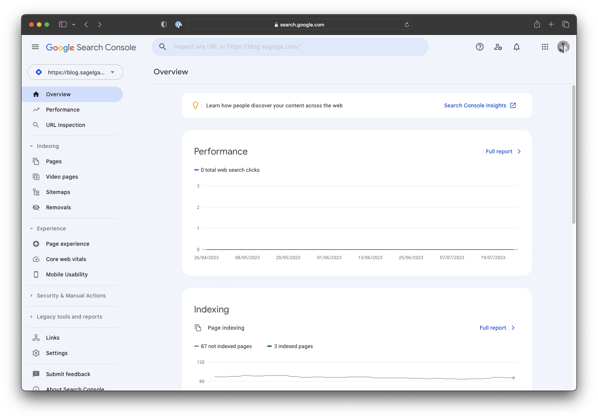

When you are talking about creating a hobby of blogging, the benefits of sharing your thoughts, and your new ideas, your passion is there, and it serves everyone. Even though it is not your main objective, the benefits of public exposure are there for you to grab.
But for some people who are getting started as a hobby, paying a whopping $10 a month for your own WordPress website is not going to be easy on you.

<!--truncate-->

How about we think about self-hosting, isn't it cheaper? Yes. But when it breaks, will you be able to fix it? I think you might not even think about self-hosting from the start. Maybe the word 'hosting' is already confusing to you.

But what if I tell you that you can get:

-   Free hosting on the website
-   Lightning-speed page loading time
-   Unlimited storage
-   Unlimited bandwidth
-   Full customizability
-   and you can show off you know computing languages like ReactJS, JavaScript, CSS, and HTML

This is how I did it with Docusaurus.

## Why choose?

**Hate it or not, WordPress, Medium, and Hashnode are made for blogging, but it's boring.** You don't own the content you are creating. You don't have control over the website fonts, website navigation bars, and everything you might want to customize. You can't just leave their service because you hate what they do with free users. This for me a deal breaker.

Again. This totally depends on you. If you like to start from the ground up, and don't even know if you are going to continue the journey of blogging or not, what I am about to explain is not for you. But keep an open mind, you might love it!

For me, it's been around 3 years since I started blogging. I couldn't stop finding new ideas and passions, so I am now obsessed with blogging and creating content based on trending topics around the world. That ignites [ByteSide.one](https://byteside.one/th/) website to become a place where you can go to.

But I kept finding solutions to WordPress. It's good, but it's expensive. So I kept trying to find the perfect blogging website for me to write my ideas and it is free.

That's why today, I like to introduce you to Docusaurus.

### Why do you need to write a blog in Docusaurus?

Here are some more reasons why you should pick Docusaurus over other blogging platforms.

1. Ludicrous page loading speed
2. No paywall for viewers whatsoever
3. Integrates with your GitHub repository
4. Active Docusaurus community
5. Unlock the power of React within your blog post

And if you have non-blog content you like to serve, Docusaurus got your back too.

### How much is Docusaurus?

None. Nill. Zill. Zero. Docusaurus is an open-sourced software made by Facebook. You only pay for your time.

\*You can optionally purchase a Custom Domain (like sagelga.com), a page builder (Netlify, GitHub Actions), and a code hosting website (Amazon S3, GitHub, GitHub Pages) to streamline your development in Docusaurus.

## Create a Docusaurus Repository

Now that you're excited about Docusaurus, let's get started on creating your own Docusaurus blog. Follow these steps to set up your Docusaurus repository:

1. Install Node.js: Before you begin, make sure you have Node.js installed on your computer. You can download it from the official website and follow the installation instructions.

2. Initialize Your Project: Open your terminal or command prompt and navigate to the folder where you want to create your Docusaurus project. Then run the following commands:

    ```bash
    npx create-docusaurus@latest init my-docusaurus-blog classic
    cd my-docusaurus-blog
    ```

3. Customize Your Blog: Now that you have your Docusaurus project set up, you can customize it according to your preferences. Open the project folder in your favorite code editor and explore the files. The main files you would want to modify are located in the docs and blog directories. The docs directory is where you can organize your documentation, while the blog directory is where you can write your blog posts.

4. Run the Development Server: To see your blog in action during the development process, run the following command:

    ```bash
    npm run start
    ```

This will start a local development server, and you can access your Docusaurus blog by visiting `http://localhost:3000` in your web browser.

## Deploy Your Blog to the Internet with Netlify

Once you've finished customizing your Docusaurus blog and are happy with how it looks and functions, it's time to deploy it to the internet. Netlify is a great platform for hosting static websites like Docusaurus blogs. Here's how you can deploy your blog using Netlify:

1. Create a Netlify Account: If you don't have one already, sign up for a free Netlify account at netlify.com.

2. Install Netlify CLI: You'll need the Netlify Command Line Interface (CLI) to deploy your blog. Install it by running the following command:

    ```bash
    npm install -g netlify-cli
    ```

3. Build Your Docusaurus Blog: Before deploying, you need to build your Docusaurus project into static files. Run the following command:

    ```bash
    npm run build
    ```

4. Deploy to Netlify: Once the build process is complete, navigate to your project folder and deploy it to Netlify using the CLI:

    ```bash
    netlify deploy
    ```

Follow the on-screen instructions, and Netlify will provide you with a live URL where your Docusaurus blog is now hosted.

## Become Google-searchable with Google Search Console

Getting your blog indexed by search engines is essential to improve its visibility and attract organic traffic. One way to speed up the SEO process is by using Google Search Console. Here's how you can set it up:

Create a Google Search Console Account: If you don't have one already, sign up for a free Google Search Console account at [search.google.com/search-console](https://search.google.com/search-console).

1. Add Your Blog URL: Once you're logged in, click on "Add a Property" and enter the URL of your Docusaurus blog. Follow the verification steps to confirm ownership.

2. Submit Your Sitemap: Docusaurus automatically generates a sitemap that helps search engines discover and index your content. Locate your sitemap at /static/sitemap.xml in your project folder. Then, submit the sitemap URL through the Google Search Console by navigating to "Sitemaps" in the left sidebar and clicking "Add a new sitemap."

3. Monitor Performance: With your blog added to Google Search Console, you can now monitor how your content is performing in search results. Keep an eye on the "Coverage" and "Performance" sections to identify any issues and track your blog's SEO progress.



Congratulations! You've successfully set up your Docusaurus blog, deployed it to the internet with Netlify, and optimized its SEO using Google Search Console. Now you can focus on creating engaging content, sharing your thoughts and ideas with the world, and enjoying the benefits of having your own customizable and freely hosted blogging platform. Happy blogging!
