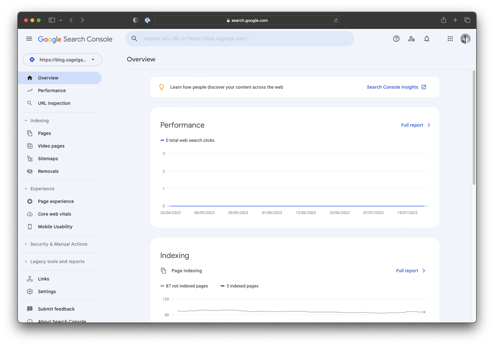

Now that you're excited about Docusaurus, let's get started on creating your own Docusaurus blog. Follow these steps to set up your Docusaurus repository:

    <!--truncate-->

1.  Install Node.js: Before you begin, make sure you have Node.js installed on your computer. You can download it from the official website and follow the installation instructions.

2.  Initialize Your Project: Open your terminal or command prompt and navigate to the folder where you want to create your Docusaurus project. Then run the following commands:

        ```bash
        npx create-docusaurus@latest init my-docusaurus-blog classic
        cd my-docusaurus-blog
        ```

3.  Customize Your Blog: Now that you have your Docusaurus project set up, you can customize it according to your preferences. Open the project folder in your favorite code editor and explore the files. The main files you would want to modify are located in the docs and blog directories. The docs directory is where you can organize your documentation, while the blog directory is where you can write your blog posts.

4.  Run the Development Server: To see your blog in action during the development process, run the following command:

    ```bash
    npm run start
    ```

This will start a local development server, and you can access your Docusaurus blog by visiting `http://localhost:3000` in your web browser.

## Deploy Your Blog to the Internet with Netlify

Once you've finished customizing your Docusaurus blog and are happy with how it looks and functions, it's time to deploy it to the internet. Netlify is a great platform for hosting static websites like Docusaurus blogs. Here's how you can deploy your blog using Netlify:

1. Create a Netlify Account: If you don't have one already, sign up for a free Netlify account at netlify.com.

2. Install Netlify CLI: You'll need the Netlify Command Line Interface (CLI) to deploy your blog. Install it by running the following command:

    ```bash
    npm install -g netlify-cli
    ```

3. Build Your Docusaurus Blog: Before deploying, you need to build your Docusaurus project into static files. Run the following command:

    ```bash
    npm run build
    ```

4. Deploy to Netlify: Once the build process is complete, navigate to your project folder and deploy it to Netlify using the CLI:

    ```bash
    netlify deploy
    ```

Follow the on-screen instructions, and Netlify will provide you with a live URL where your Docusaurus blog is now hosted.

## Become Google-searchable with Google Search Console

Getting your blog indexed by search engines is essential to improve its visibility and attract organic traffic. One way to speed up the SEO process is by using Google Search Console. Here's how you can set it up:

Create a Google Search Console Account: If you don't have one already, sign up for a free Google Search Console account at [search.google.com/search-console](https://search.google.com/search-console).

1. Add Your Blog URL: Once you're logged in, click on "Add a Property" and enter the URL of your Docusaurus blog. Follow the verification steps to confirm ownership.

2. Submit Your Sitemap: Docusaurus automatically generates a sitemap that helps search engines discover and index your content. Locate your sitemap at /static/sitemap.xml in your project folder. Then, submit the sitemap URL through the Google Search Console by navigating to "Sitemaps" in the left sidebar and clicking "Add a new sitemap."

3. Monitor Performance: With your blog added to Google Search Console, you can now monitor how your content is performing in search results. Keep an eye on the "Coverage" and "Performance" sections to identify any issues and track your blog's SEO progress.



Congratulations! You've successfully set up your Docusaurus blog, deployed it to the internet with Netlify, and optimized its SEO using Google Search Console. Now you can focus on creating engaging content, sharing your thoughts and ideas with the world, and enjoying the benefits of having your own customizable and freely hosted blogging platform. Happy blogging!
